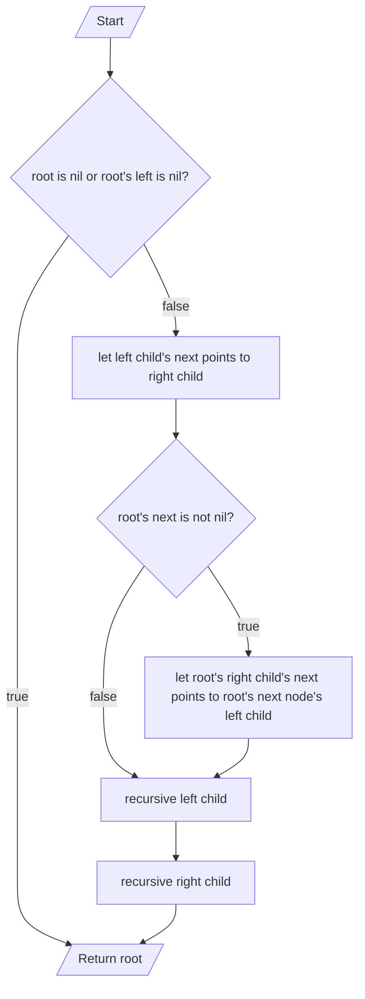

## Flowchart

```mermaid
graph TB
	id0[/Start/] --> id1{root is nil or root's left is nil?}
	id1 --true--> id2[/Return root/]
	id1 --false--> id3[let left child's next points to right child]
	id3 --> id4{root's next is not nil?}
	id4 --true--> id5[let root's right child's next points to root's next node's left child]
	id4 --false--> id6[recursive left child]
	id5 --> id6
	id6 --> id7[recursive right child]
	id7 --> id2
```